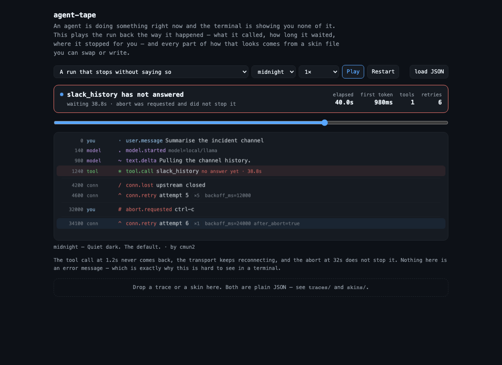
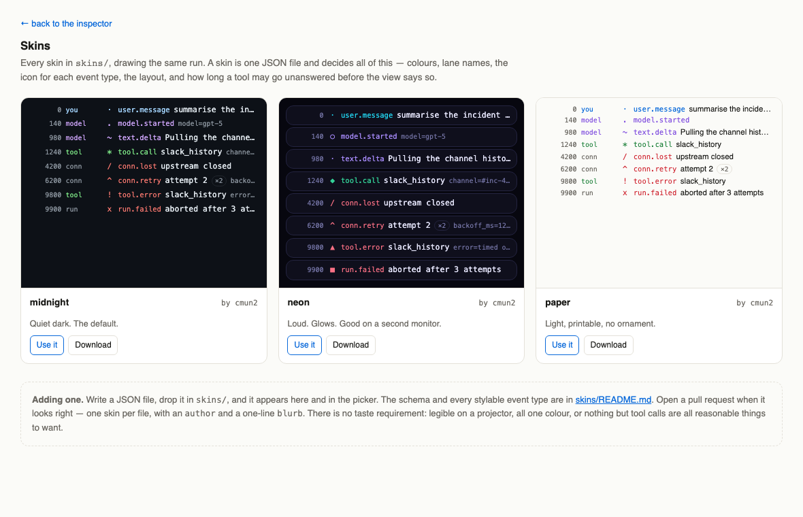

# agent-hours

**Your agent worked for four hours. It cannot tell you what it spent them on.**

Claude Code and Codex both write a full record of every session — every tool call, every result,
every timestamp — and then show you none of it once the session ends. `agent-hours` reads those
files and answers the questions the live output never does, either as a report or as a timeline you
can play back.

```console
python3 agenthours.py                      # the session you just finished
python3 agenthours.py --list               # everything on this machine
python3 agenthours.py --tape --out run.json   # the same session, as a timeline
```

Standard library only. Nothing to install, no instrumentation, no configuration — the data is
already on your disk.

## What it tells you

```
  c7bc7b22   275 tool calls   1h 23m active   over 12h 28m

  WHERE THE TIME WENT
    running tools    █████·······················   14m 00s    17%
    model thinking   ███████████████████████·····    1h 09m    83%

  BY TOOL
    tool               calls     total   median   slowest
    Bash                  85   13m 35s       3s    1m 20s
    Write                 88       14s       0s        7s
    Edit                  71        6s       0s        0s

  SLOWEST SINGLE CALLS
      1m 20s  Bash            git init -b main && pnpm create next-app@late…
         48s  Bash            pnpm lint 2>&1 | tail -2 && pnpm typecheck 2>…

  RAN AGAIN  (76 calls were a repeat of one already made)
      14×  Write           …/src/components/ProjectCard.tsx
      14×  Edit            …/src/components/ProjectCard.tsx

  FAILED  (12 of 275, 4.4%)
```

A CLI already shows you the tool calls and the text as they happen. What none of them show is the
part that costs you: how long each tool actually took, how much of the run was the model thinking
rather than anything executing, which work got done twice, and what failed. Those four survive the
session here and nowhere else.

**Where the time actually went.** A run that felt slow is usually the model thinking, not the tools
running, and the split is not a thing you can eyeball from a spinner. Idle gaps longer than five
minutes are dropped, so leaving a session open overnight does not distort the number.

**Which tool costs you.** Total, median and slowest per tool. The median is usually tiny and the
slowest is a minute — that spread is the thing to fix, and an average would hide it.

**What ran again.** The same command, the same file edited over and over. This is the closest thing
to a measure of an agent going in circles, and it is invisible while it happens.

**What actually failed.** Only the calls the transcript flags as errors, plus interrupted ones and
output that names a real failure. A tool writing to stderr is not a failure — counting it as one put
the error rate at 56% in an early version of this, against a true 1.9%.

## Watching it back

`--tape` writes the session as a trace for the viewer in [`viewer/`](viewer/) — the same numbers,
laid out on a clock instead of in a table.

```console
python3 agenthours.py --tape --out run.json
open viewer/index.html          # then drop run.json on the page
```

<p align="center">
  
</p>

The timeline is worth having for one reason the report cannot give you: **order**. A repeat is a row
you can see coming back, a slow tool is a visible gap, and a call that never answered stays open on
screen instead of being a line in a table. Every `tool.call` that repeated work already done is
labelled `N of M`, and the count matches the report's `RAN AGAIN` exactly.

Two things about the clock, because a real session is not a demo:

- **Working time is drawn to scale.** A 40-second wait for the model is 40 seconds of tape. For a
  long session use the `instant` speed and scrub, rather than pressing play.
- **Idle gaps are not.** Anything over five minutes collapses to a fixed width and is labelled with
  its real duration — `idle 21h 19m — not drawn to scale`. A session left open overnight would
  otherwise be a screen of nothing. The trace's note line states the total that was collapsed.

⚠️ **A trace carries the commands, paths, and queries from your session.** That is the point of it,
and it also means it is not automatically safe to share. Read the file before you send it anywhere.

## Skins

The viewer's appearance is entirely a JSON file — colours, lane names, the icon for every event
type, the layout, and how long a tool may go unanswered before the view says so.

<p align="center">
  
</p>

```json
{
  "name": "neon",
  "author": "your-handle",
  "blurb": "Loud. Glows. Good on a second monitor.",
  "colors": { "bg": "#07070f", "panel": "#0f0f1c", "accent": "#22d3ee" },
  "lanes": { "tool": { "color": "#34d399", "label": "TOOL" } },
  "types": { "tool.error": { "color": "#fb7185", "icon": "▲" } },
  "layout": "cards", "font": "mono", "glow": true, "stuckAfterMs": 5000
}
```

Drop a file in `viewer/skins/` and it appears in the picker and in the gallery. Drag one onto the
page to try it without saving. The schema, the fallbacks, and every stylable event type are in
[`viewer/skins/README.md`](viewer/skins/README.md) — pull requests adding skins are the point of
that directory.

## Traces

A trace is a flat list of events. `--tape` generates them, and you can write them by hand:

```json
{ "t": 1240, "lane": "tool", "type": "tool.call", "label": "slack_history",
  "id": "h1", "meta": { "channel": "#inc-441" } }
```

`t` is milliseconds from the start, `lane` is who acted, `type` is what happened. `id` pairs a
`tool.call` with its `tool.result` — without it a call can never be shown as unanswered, which is
most of the value. Drop a file on the page to load it; a bare array is read as one run.

The four traces in `viewer/traces/` are hand-written shapes rather than recordings: a research run
with parallel fetches, a coding run where a test fails once, a two-agent handoff that waits on an
approval, and a run that stops without saying so. They exist to show what the viewer does with
event types your own sessions will not produce — aborts, lost connections, handoffs. **For your own
data, use `--tape`.**

## Both CLIs

| | where it reads from |
|---|---|
| Claude Code | `~/.claude/projects/*/*.jsonl` |
| Codex | `~/.codex/sessions/*/*/*/rollout-*.jsonl` |

`--list` shows both, newest first. `--from claude` or `--from codex` narrows it. Pass a path
directly to read one file.

Durations are derived, not recorded: a call starts when the agent emits it and ends when its result
comes back, both of which carry a timestamp. Claude Code stores a `durationMs` on roughly one call
in eight hundred, so deriving it is the only way to have the number at all.

`AskUserQuestion` and `ExitPlanMode` are counted separately, under "waiting on you" — a person
deciding is not the agent being slow. On the tape they are an `approval.requested` / 
`approval.granted` pair, for the same reason.

## License

MIT.
